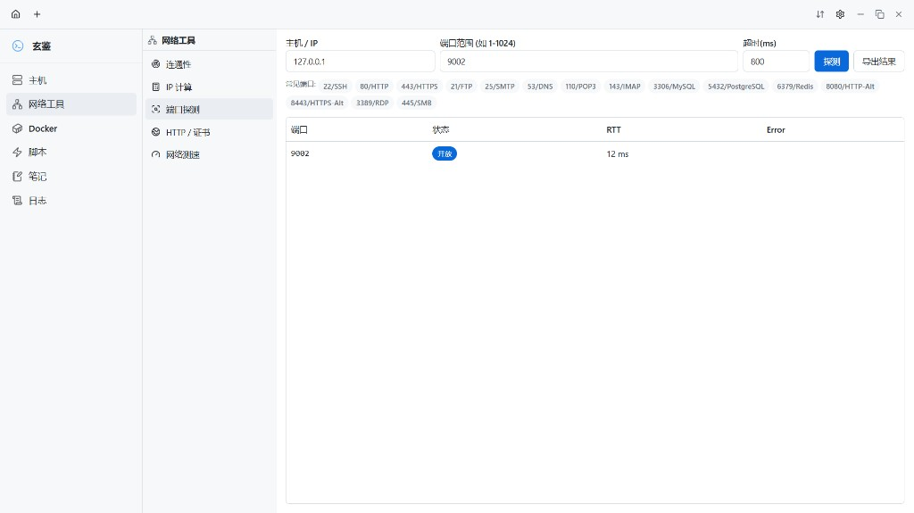
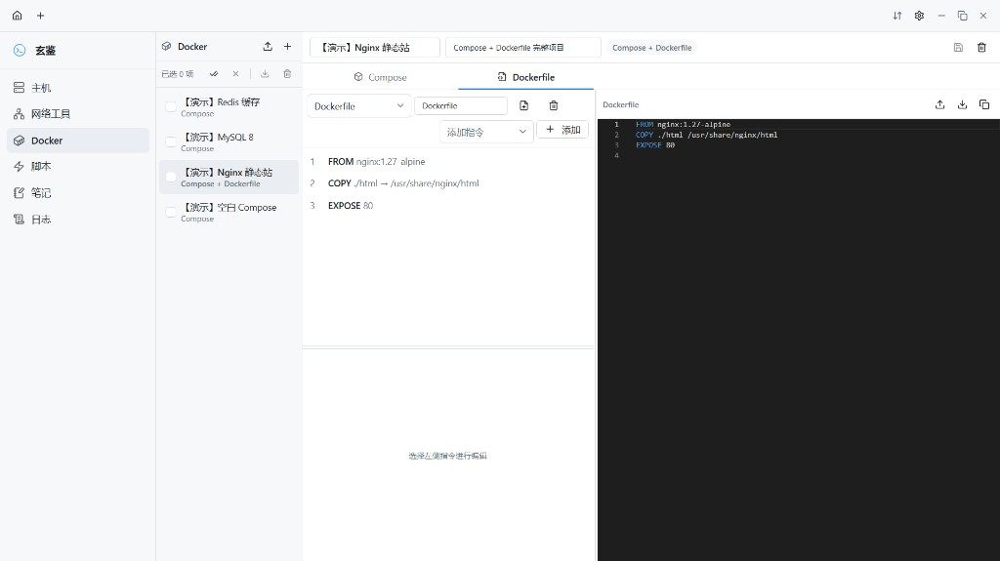
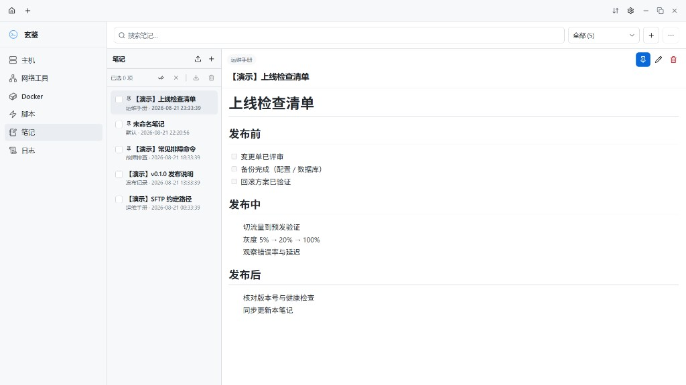
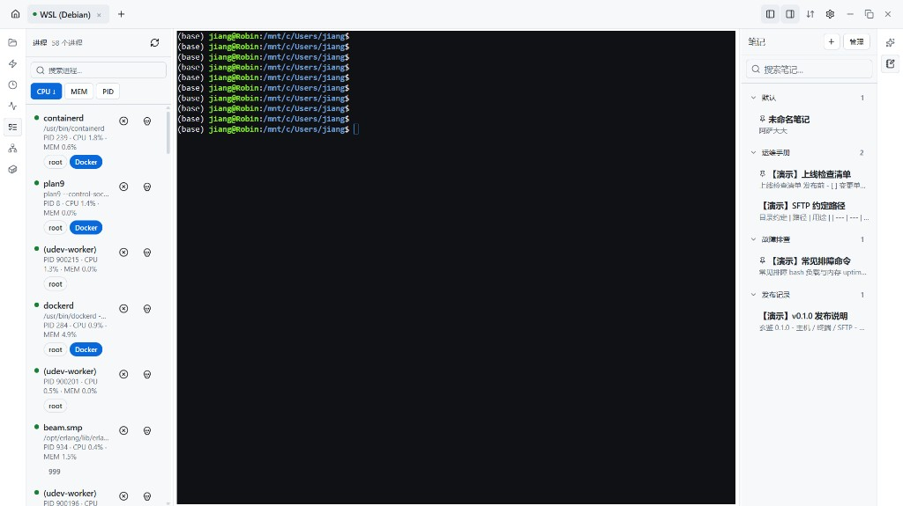
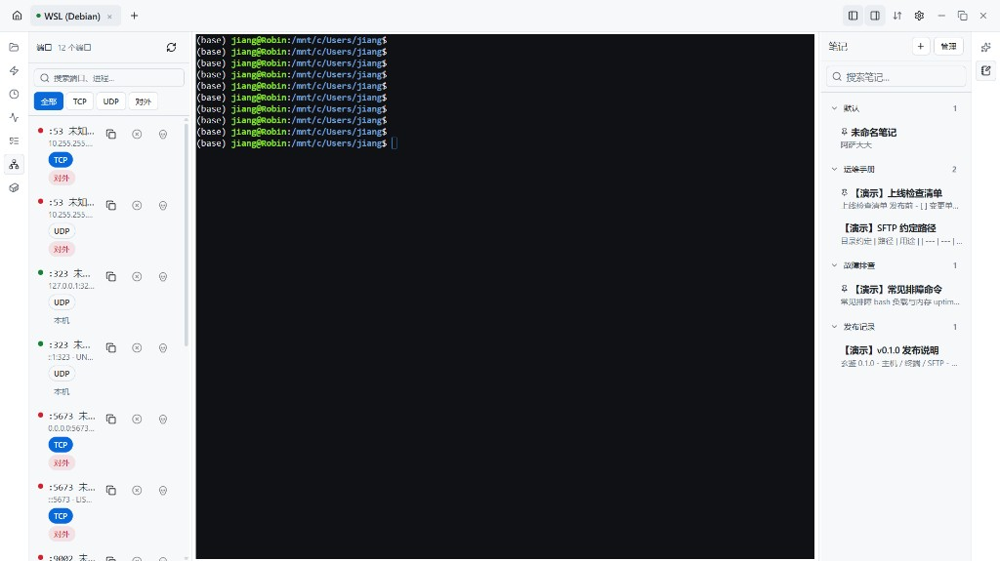

# 玄鉴 / Xuanjian

<p align="center">
  
</p>

<p align="center">
  
  
  
  
  
  
  
  
  
</p>

**玄鉴（Xuanjian）** 是一款面向运维与现场排查的 **桌面运维工作台**：主机清单、本地 / SSH 终端、SFTP、脚本与笔记、会话录制回放，以及本机网络工具与 Docker Compose / Dockerfile 编排，集于一体。基于 **Tauri 2 + React + TypeScript + Rust**，数据本地 SQLite 持久化，跨 Windows / macOS / Linux。

> 当前版本：`0.1.0` · 协议：[MIT License](LICENSE) · 应用标识：`io.github.jiangbyte.xuanjian` · 仓库：[jiangbyte/xuanjian](https://github.com/jiangbyte/xuanjian)

## 目录

- [界面预览](#界面预览)
- [功能特性](#功能特性)
- [技术栈](#技术栈)
- [工程结构](#工程结构)
- [快速开始](#快速开始)
- [常用脚本](#常用脚本)
- [快捷键](#快捷键)
- [相关文档](#相关文档)
- [License](#license)

## 界面预览

### 主机与网络

<table>
  <tr>
    <td width="50%"></td>
    <td width="50%"></td>
  </tr>
  <tr>
    <td align="center">主机操作台</td>
    <td align="center">连通性 · Ping</td>
  </tr>
  <tr>
    <td width="50%"></td>
    <td width="50%"></td>
  </tr>
  <tr>
    <td align="center">连通性 · 路由追踪</td>
    <td align="center">IP 计算 · 子网拓扑</td>
  </tr>
  <tr>
    <td colspan="2" align="center"></td>
  </tr>
  <tr>
    <td colspan="2" align="center">端口探测</td>
  </tr>
</table>

### Docker · 脚本 · 笔记 · 日志

<table>
  <tr>
    <td width="50%"></td>
    <td width="50%"></td>
  </tr>
  <tr>
    <td align="center">Docker · Compose</td>
    <td align="center">Docker · Compose + Dockerfile</td>
  </tr>
  <tr>
    <td width="50%"></td>
    <td width="50%"></td>
  </tr>
  <tr>
    <td align="center">Docker · Dockerfile</td>
    <td align="center">脚本库</td>
  </tr>
  <tr>
    <td width="50%"></td>
    <td width="50%"></td>
  </tr>
  <tr>
    <td align="center">笔记</td>
    <td align="center">会话日志</td>
  </tr>
</table>

### 终端工作区

<table>
  <tr>
    <td width="50%"></td>
    <td width="50%"></td>
  </tr>
  <tr>
    <td align="center">文件 / SFTP</td>
    <td align="center">侧栏脚本</td>
  </tr>
  <tr>
    <td width="50%"></td>
    <td width="50%"></td>
  </tr>
  <tr>
    <td align="center">主机概览</td>
    <td align="center">进程</td>
  </tr>
  <tr>
    <td width="50%"></td>
    <td width="50%"></td>
  </tr>
  <tr>
    <td align="center">端口</td>
    <td align="center">侧栏 Docker</td>
  </tr>
</table>

## 功能特性

- **主机操作台**：分组 / 标签 / 排序；口令 AES 加密入库；一键连接 SSH 或粘贴 `user@host` 目标
- **终端工作区**：本地 Shell（Windows：PowerShell / CMD / WSL；macOS / Linux：zsh / bash / fish 等）+ SSH（xterm）；标签 keep-alive；快速切换（`Ctrl/⌘+J`）；左右侧栏（文件、脚本、历史、概览、进程、端口、Docker）
- **SFTP / 本地文件**：双栏浏览、上传下载、冲突处理、权限与编辑
- **Docker 编排工作室**：可视化编辑 Compose（服务 / 网络 / 卷）与 Dockerfile，YAML / 源码双向同步，模板、导入导出与复制；会话侧栏可管理容器并 **实时跟随日志**（最多 1000 行）
- **脚本与笔记**：脚本包管理、变量占位、多目标执行；Markdown 笔记分类与自动保存
- **会话日志**：终端输入输出录制、列表筛选、回放与导出；关闭标签后正确收尾「进行中」状态
- **网络工具**：连通性（Ping / 路由追踪 / DNS，含可视化）、IP 计算与子网拓扑划分、端口探测、HTTP / TLS / Whois、网络测速（内网服务与自定义端点）
- **体验与工程**：无边框标题栏；主题 light / dark / system；i18n（zh-CN / en）；Biome + CI

## 技术栈

| 层级 | 技术 |
| --- | --- |
| 桌面壳 | Tauri 2 · SQLite 插件 · Dialog / Clipboard / Opener |
| 前端 | React 19 · TypeScript · Vite 7 · Tailwind CSS 4 · shadcn/ui · Zustand · React Router · i18next · Recharts |
| 终端 / 编辑 / 画布 | xterm.js · Monaco · `@uiw` Markdown · `@xyflow/react` · dagre |
| 后端 | Rust 2021 · Tokio · russh / russh-sftp · portable-pty · aes-gcm · reqwest |
| 工程 | pnpm · Biome · GitHub Actions（typecheck / lint / build / cargo check） |

## 工程结构

```text
xuanjian
├── src/                          # React 前端
│   ├── features/                 # 业务页
│   │   ├── hosts/                # 主机操作台
│   │   ├── terminal/             # 终端 · SFTP · 侧栏面板
│   │   ├── network/              # 网络工具（连通性 / IP / 端口 / HTTP / 测速）
│   │   ├── docker/               # Compose / Dockerfile 编排工作室
│   │   ├── scripts/ · notes/ · logs/
│   │   └── settings/
│   ├── components/               # 共享壳与通用 UI
│   ├── lib/                      # DB / Tauri 封装 / 会话录制等（路径别名 @/）
│   ├── stores/                   # Zustand 状态
│   ├── i18n/                     # 文案（locales/zh-CN · en）
│   └── styles/                   # 全局样式分片
├── src-tauri/
│   ├── icons/                    # 应用图标（由 docs/images/app-icon-source.png 生成）
│   ├── src/
│   │   ├── commands/             # Tauri 命令薄层
│   │   ├── session/              # 本地 PTY · SSH · SFTP · 流式 exec
│   │   ├── network/              # 本机网络工具 · 测速
│   │   ├── db/                   # SQLite 迁移
│   │   └── crypto.rs             # 口令加解密
│   ├── capabilities/
│   └── tauri.conf.json
├── docs/
│   ├── images/                   # README 截图与图标源文件
│   └── 工程规范.md
└── .github/workflows/ci.yml
```

## 快速开始

### 环境要求

- Node.js **22+**、pnpm **9+**
- Rust **stable**（[rustup](https://rustup.rs/)）
- 系统依赖见 [Tauri 前置条件](https://v2.tauri.app/start/prerequisites/)（Windows / macOS / Linux）

### 安装与开发

```powershell
git clone git@github.com:jiangbyte/xuanjian.git
cd xuanjian
pnpm install
pnpm tauri dev
```

开发时 Vite 默认：`http://localhost:1420`；桌面窗口由 Tauri 拉起。

### 生产构建

```powershell
pnpm tauri build
```

## 常用脚本

| 命令 | 说明 |
| --- | --- |
| `pnpm tauri dev` | 启动桌面端开发 |
| `pnpm typecheck` | TypeScript 类型检查 |
| `pnpm lint` | Biome 静态检查 |
| `pnpm format` | Biome 格式化 |
| `pnpm build` | 前端生产构建 |
| `pnpm ci` | 本地等价前端 CI：typecheck + lint + build |
| `cargo check`（在 `src-tauri`） | Rust 编译检查（CI 使用 `-D warnings`） |

GitHub Actions：push / PR 到 `main` 时执行 `.github/workflows/ci.yml`。

## 快捷键

| 快捷键 | 说明 |
| --- | --- |
| `Ctrl+J` | 快速切换（本地 Shell / 主机 / 终端标签） |
| `Ctrl+Shift+C` / `Ctrl+Shift+V` | 终端复制 / 粘贴（系统剪贴板） |

## 相关文档

| 文档 | 说明 |
| --- | --- |
| [`docs/工程规范.md`](docs/工程规范.md) | 目录约定、`@/` 别名、注释规范、模块边界与 CI |
| [`src-tauri/tauri.conf.json`](src-tauri/tauri.conf.json) | 窗口、打包与 SQLite 预加载配置 |
| [Tauri 2 文档](https://v2.tauri.app/) | 官方桌面端文档 |

## License

本项目基于 [MIT License](LICENSE) 开源。完整条款见 [LICENSE](LICENSE)，版权声明见 [NOTICE](NOTICE)。

```text
Copyright 2026 jiangbyte (Charlie Zhang)
```
