# 玄鉴 / Xuanjian

<p align="center">
  
</p>

<p align="center">
  
  
  
  
  
  
  
  
  
</p>

**玄鉴（Xuanjian）** 是一款面向运维与现场排查的 **AI 桌面运维工作台**：主机清单、本地 / SSH / WSL 终端、SFTP、脚本与笔记、会话录制回放、本机网络工具与 Docker 编排，并内置 **玄鉴 Agent**——基于 LangGraph 本地编排，可在**独立下栏终端**中可观测地执行命令，按 ReAct 完成排查与运维任务。基于 **Tauri 2 + React + Rust**，数据本地 SQLite 持久化，跨 Windows / macOS / Linux。

> 当前版本：`1.3.0` · 协议：[MIT License](LICENSE) · 应用标识：`io.github.jiangbyte.xuanjian` · 仓库：[jiangbyte/xuanjian](https://github.com/jiangbyte/xuanjian)

## 目录

- [界面预览](#界面预览)
- [功能特性](#功能特性)
- [技术栈](#技术栈)
- [工程结构](#工程结构)
- [快速开始](#快速开始)
- [常用脚本](#常用脚本)
- [快捷键](#快捷键)
- [相关文档](#相关文档)
- [License](#license)

## 界面预览

### 玄鉴 Agent

终端工作区采用**上下分屏**：上方为用户交互终端，下方为 **Agent 下栏终端**（多标签、实时可见命令输出）。右侧栏为 Agent 对话，支持 ReAct 轨迹、工具确认与 SubAgent 派发。

<table>
  <tr>
    <td width="50%">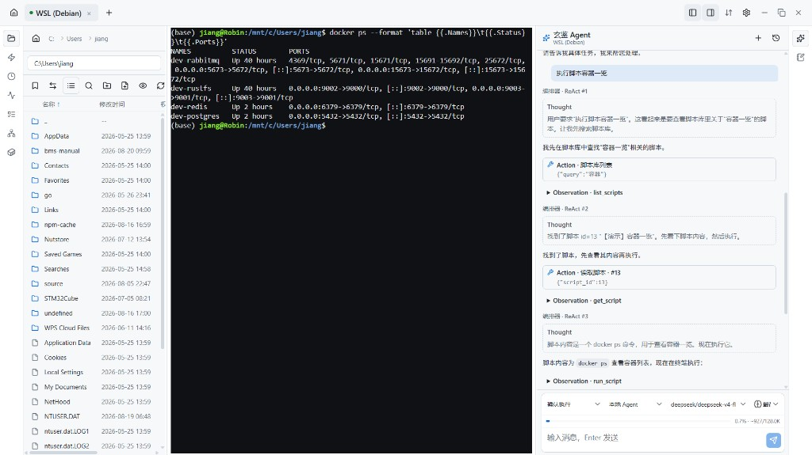</td>
    <td width="50%">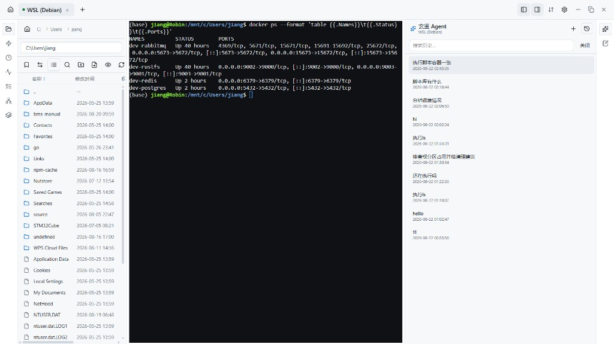</td>
  </tr>
  <tr>
    <td align="center">ReAct：检索脚本库 → 下栏终端执行 → 可见输出</td>
    <td align="center">会话历史 · 多轮排查与脚本查询</td>
  </tr>
  <tr>
    <td colspan="2" align="center">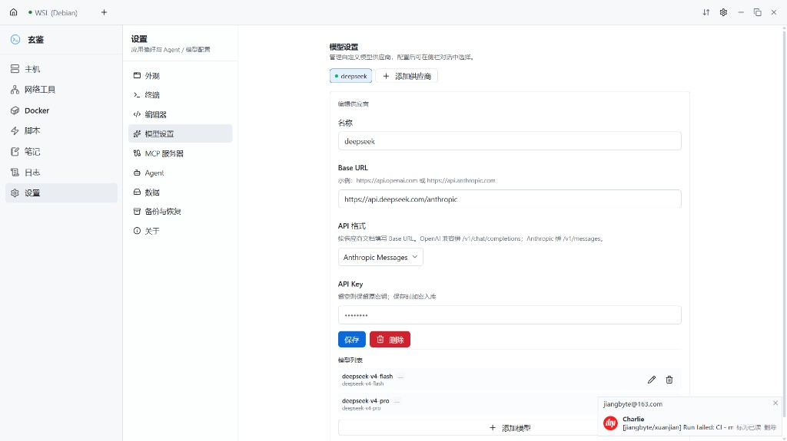</td>
  </tr>
  <tr>
    <td colspan="2" align="center">模型设置 · OpenAI 兼容 / Anthropic Messages · MCP 扩展</td>
  </tr>
</table>

### 主机与网络

<table>
  <tr>
    <td width="50%">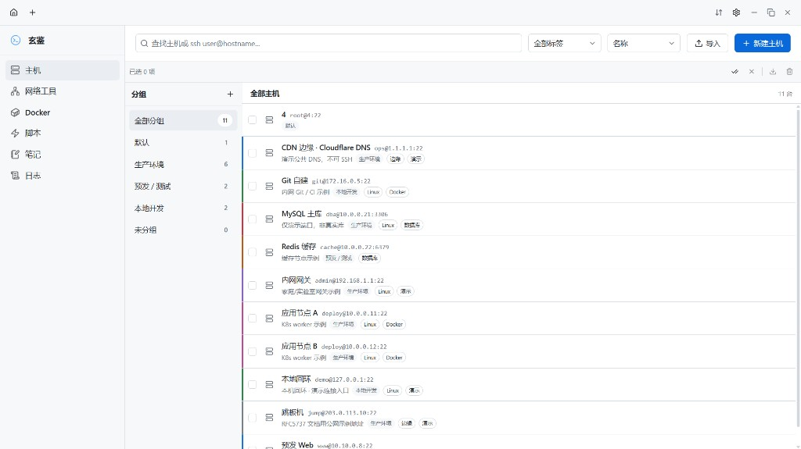</td>
    <td width="50%">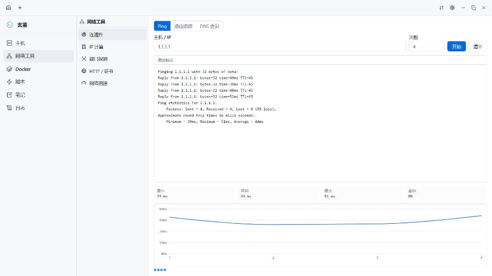</td>
  </tr>
  <tr>
    <td align="center">主机操作台</td>
    <td align="center">连通性 · Ping / DNS / 路由追踪</td>
  </tr>
  <tr>
    <td width="50%">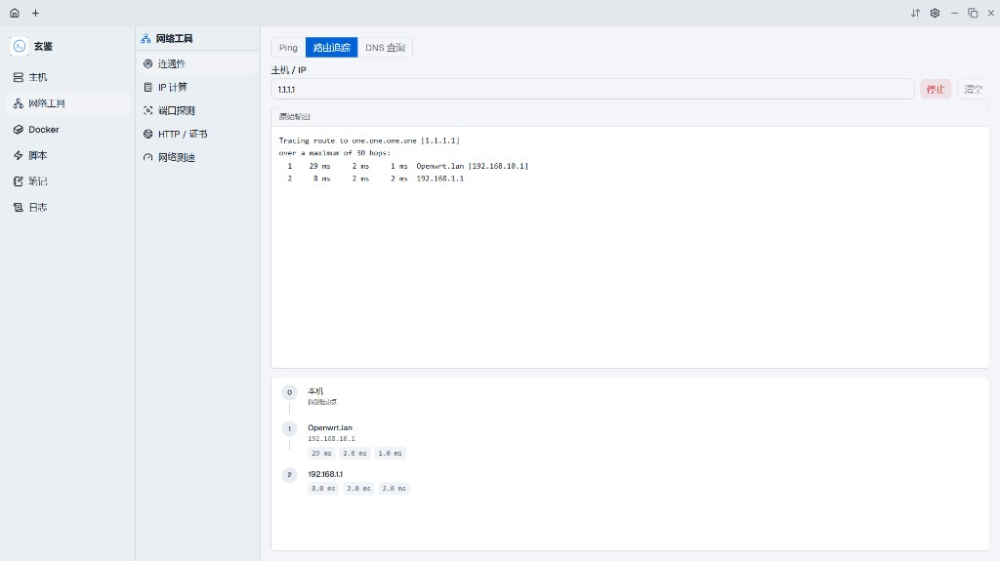</td>
    <td width="50%">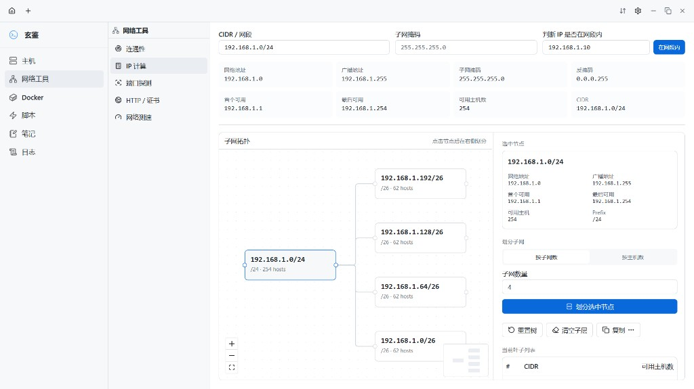</td>
  </tr>
  <tr>
    <td align="center">连通性 · 路由追踪</td>
    <td align="center">IP 计算 · 子网拓扑 · 端口 / 连接 / 测速</td>
  </tr>
</table>

### Docker · 脚本 · 笔记 · 日志

<table>
  <tr>
    <td width="50%">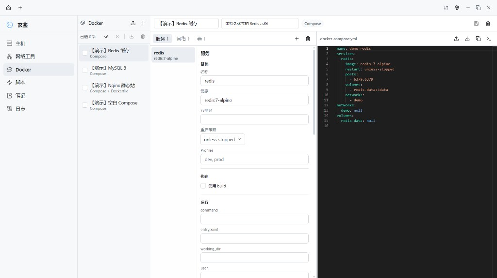</td>
    <td width="50%">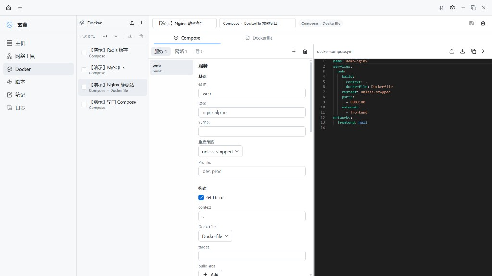</td>
  </tr>
  <tr>
    <td align="center">Docker · Compose 编排工作室</td>
    <td align="center">Compose + Dockerfile 可视化</td>
  </tr>
  <tr>
    <td width="50%">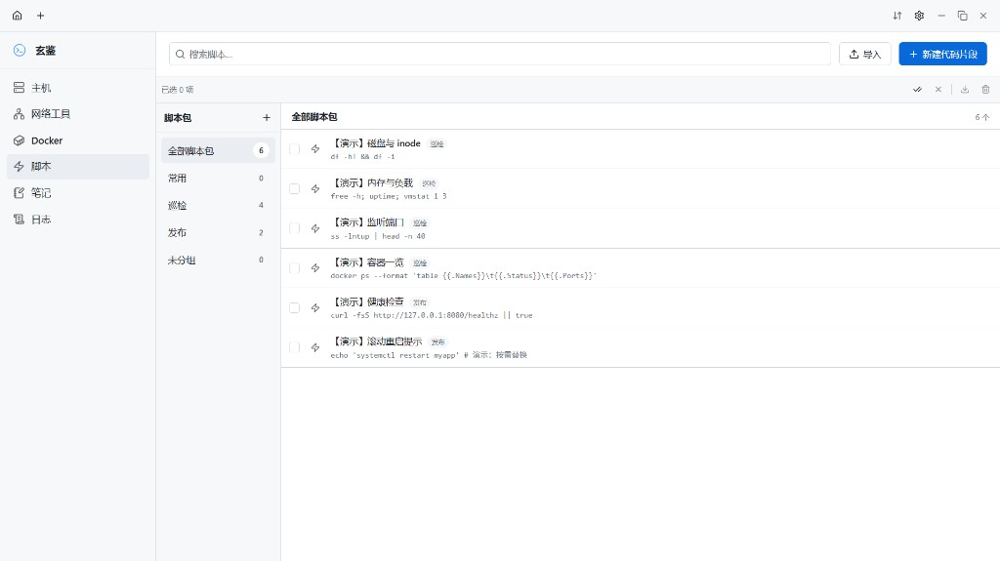</td>
    <td width="50%">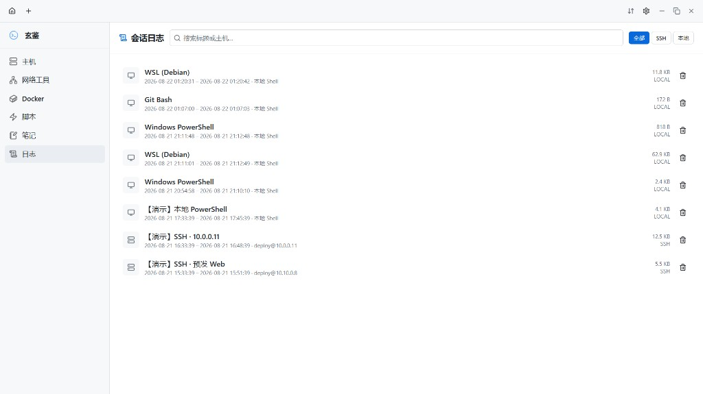</td>
  </tr>
  <tr>
    <td align="center">脚本库 · 变量占位 · 批量执行</td>
    <td align="center">会话录制 · 回放与导出</td>
  </tr>
</table>

### 终端工作区

<table>
  <tr>
    <td width="50%">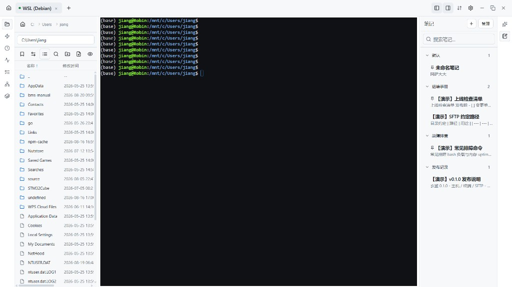</td>
    <td width="50%">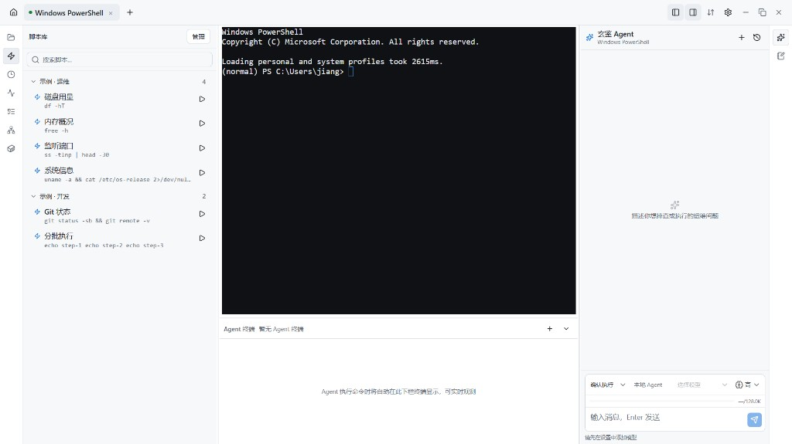</td>
  </tr>
  <tr>
    <td align="center">SFTP · 拖放上传 · 框选多选</td>
    <td align="center">侧栏脚本 · 历史命令 · 笔记</td>
  </tr>
  <tr>
    <td width="50%">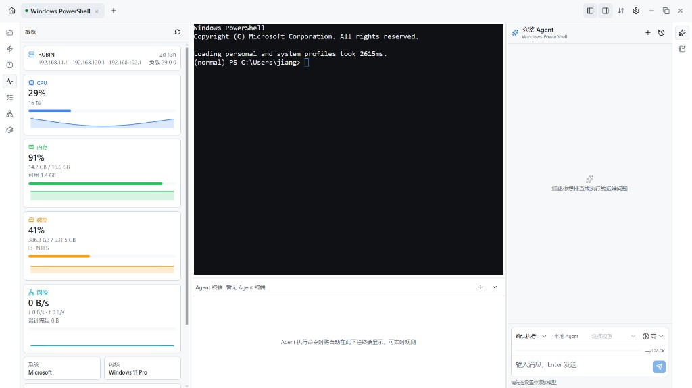</td>
    <td width="50%">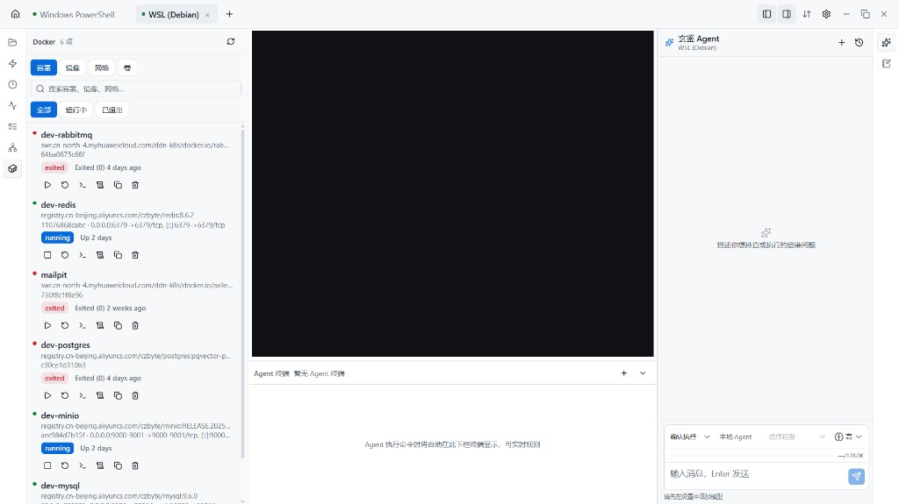</td>
  </tr>
  <tr>
    <td align="center">概览 · 进程 · 端口</td>
    <td align="center">Docker 侧栏 · 实时日志跟随</td>
  </tr>
</table>

## 功能特性

### v1.3 亮点

- **Agent 下栏终端**：与用户主终端分离的独立 PTY；`terminal_run` / `session_exec` 在下栏可见执行；支持多标签与面板收起
- **Agent 运行时加固**：LangGraph 编排（`agent-core` / `agent-adapters`）；工具输出录制与 transcript 回放；`terminal_tail` 与下栏会话对齐
- **终端侧栏体验**：紧凑列表密度；Docker 日志可选中复制、自动跟随最新；SFTP 工具栏窄屏横向滚动
- **网络工具增强**：连接列表、流量监控、测速图表等面板扩展
- **设置重组**：Agent 目录、插件/工具、MCP 分区更清晰

### 核心能力

| 模块 | 说明 |
| --- | --- |
| **主机操作台** | 分组 / 标签 / 排序；口令 AES 加密；一键 SSH 或粘贴 `user@host` |
| **终端工作区** | 本地 Shell + SSH（xterm）；多标签 keep-alive；左侧栏（文件、脚本、历史、概览、进程、端口、Docker）；右侧 **Agent / 笔记** |
| **玄鉴 Agent** | LangGraph Orchestrator + SubAgent（巡检 / 终端 / 部署 / 分析）；权限模式（计划 / 确认 / 完全）；MCP 工具动态合并；上下文压缩与用量计量 |
| **模型与协议** | 自定义供应商；**OpenAI 兼容** 与 **Anthropic Messages**；思考强度、上下文窗口可配 |
| **SFTP / 文件** | 双栏浏览、上传下载、冲突处理、内联编辑 |
| **Docker** | Compose / Dockerfile 编排工作室；会话侧栏管理容器、**实时跟随日志** |
| **脚本与笔记** | 脚本包、变量占位、多目标执行；Markdown 笔记分类与自动保存 |
| **会话日志** | 终端 I/O 录制、筛选、回放、导出 |
| **网络工具** | Ping / 路由 / DNS、IP 计算、端口探测、HTTP / TLS、测速、连接与流量 |
| **自动化与观测** | 批量脚本、Cron、告警、机群概览、审计控制台 |
| **数据与安全** | 本地 SQLite；工作空间同步与 deploy 配方；备份导出（可选 AES 加密） |

## 技术栈

| 层级 | 技术 |
| --- | --- |
| 桌面壳 | Tauri 2 · SQLite 插件 · Dialog / Clipboard / Opener |
| 前端 | React 19 · TypeScript · Vite 7 · Tailwind CSS 4 · shadcn/ui · Zustand · React Router · i18next |
| 终端 / 编辑 | xterm.js · Monaco · `@uiw` Markdown · `@xyflow/react` · Recharts / ECharts |
| Agent | **LangGraph**（`packages/agent-core`）· Tauri 适配层（`packages/agent-adapters`）· 本地 ReAct · MCP |
| 后端 | Rust 2021 · Tokio · russh / russh-sftp · portable-pty · aes-gcm · reqwest · hickory-resolver |
| 工程 | pnpm workspace · Biome · Vitest · GitHub Actions（前端 CI + 三端 `cargo check` + Release 构建） |

## 工程结构

```text
xuanjian/                         # pnpm workspace 根
├── packages/
│   ├── agent-core/               # LangGraph 编排、压缩、Guard、RuntimeEvent
│   └── agent-adapters/           # Tauri LLM / Tools / DB 端口实现
├── src/                          # React 前端
│   ├── features/
│   │   ├── hosts/                # 主机操作台
│   │   ├── terminal/             # 终端 · SFTP · Agent 下栏 · AiChatPanel
│   │   ├── network/              # 网络工具
│   │   ├── docker/               # Compose / Dockerfile 编排
│   │   ├── scripts/ · notes/ · logs/ · audit/ · automation/ · fleet/
│   │   └── settings/             # 外观 / 终端 / 模型 / MCP / Agent …
│   ├── lib/
│   │   ├── agent/                # 工具定义 · handlers · runtime · history
│   │   ├── db/                   # SQLite 访问
│   │   └── session/              # PTY · SSH · 录制 · agentTerminal
│   ├── stores/ · i18n/ · styles/ · components/
├── src-tauri/
│   ├── src/
│   │   ├── commands/             # Tauri 命令
│   │   ├── ai/                   # LLM HTTP 代理
│   │   ├── session/              # 本地 PTY · SSH · SFTP
│   │   ├── network/              # 本机网络探测 · 测速
│   │   └── db/                   # SQLite 迁移
│   └── tauri.conf.json
├── docs/                         # 架构说明 · 发行说明 · 工程规范
└── .github/workflows/            # ci.yml · release.yml
```

## 快速开始

### 环境要求

- Node.js **22+**、pnpm **9+**
- Rust **stable**（[rustup](https://rustup.rs/)）
- 系统依赖见 [Tauri 前置条件](https://v2.tauri.app/start/prerequisites/)

### 安装与开发

```bash
git clone https://github.com/jiangbyte/xuanjian.git
cd xuanjian
pnpm install
pnpm tauri dev
```

开发时 Vite 默认 `http://localhost:1420`；桌面窗口由 Tauri 拉起。

在 **设置 → 模型** 中添加供应商与模型后，即可在终端右侧 **玄鉴 Agent** 中对话。Base URL 按所选 API 格式填写（OpenAI 兼容根地址，或 Anthropic Messages 入口）。

### 生产构建

```bash
pnpm tauri build
```

产物位于 `src-tauri/target/release/bundle/`（平台相关：`.exe` / `.msi` / `.dmg` / `.deb` / `.AppImage` 等）。

## 常用脚本

| 命令 | 说明 |
| --- | --- |
| `pnpm tauri dev` | 启动桌面端开发 |
| `pnpm typecheck` | TypeScript + agent-core 类型检查 |
| `pnpm lint` | Biome 静态检查 |
| `pnpm format` | Biome 格式化前端 |
| `pnpm test` | Vitest 单元测试 |
| `pnpm build` | 前端生产构建 |
| `pnpm ci` | 本地等价 CI：typecheck + lint + test + build |
| `cargo fmt`（在 `src-tauri`） | Rust 代码格式化 |
| `cargo check`（在 `src-tauri`） | Rust 编译检查（CI 使用 `-D warnings`） |

推送 `v*` tag 将触发 [Release 工作流](.github/workflows/release.yml)，构建 Windows / macOS / Linux 安装包并发布到 GitHub Releases。

## 快捷键

| 快捷键 | 说明 |
| --- | --- |
| `Ctrl+J` / `⌘+J` | 快速切换（本地 Shell / 主机 / 终端标签） |
| `Ctrl+Shift+C` / `Ctrl+Shift+V` | 终端复制 / 粘贴（系统剪贴板） |

## 相关文档

| 文档 | 说明 |
| --- | --- |
| [`docs/ARCHITECTURE.md`](docs/ARCHITECTURE.md) | Agent LangGraph 分层与事件协议 |
| [`docs/release-notes/v1.3.0.md`](docs/release-notes/v1.3.0.md) | v1.3.0 发行说明 |
| [`docs/工程规范.md`](docs/工程规范.md) | 目录约定、模块边界与 CI |
| [`src-tauri/tauri.conf.json`](src-tauri/tauri.conf.json) | 窗口、打包与 SQLite 配置 |
| [Tauri 2 文档](https://v2.tauri.app/) | 官方桌面端文档 |

## License

本项目基于 [MIT License](LICENSE) 开源。完整条款见 [LICENSE](LICENSE)，版权声明见 [NOTICE](NOTICE)。

```text
Copyright 2026 jiangbyte (Charlie Zhang)
```
